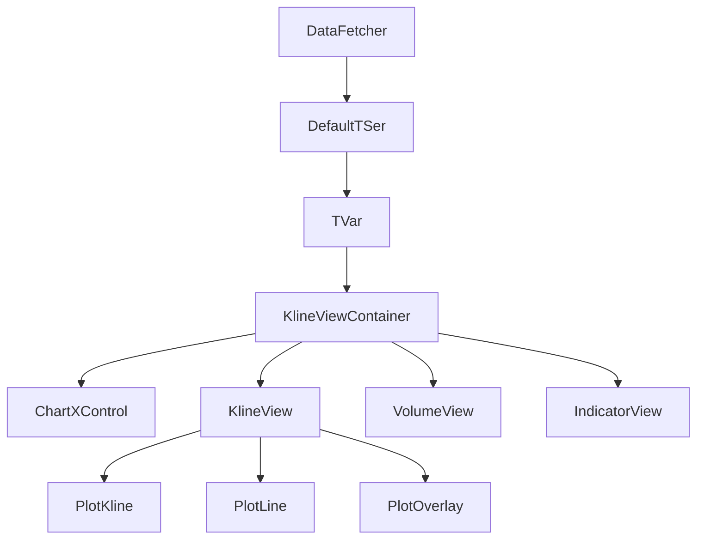

## Project Structure

VibeTrader is a TypeScript-based charting application built with React, organized into a clean, modular architecture:

```
src/
├── lib/
│   ├── timeseris/      # Time series data management
│   ├── charting/        # Chart rendering components
│   │   ├── view/        # Main view components
│   │   ├── plot/        # Plot renderers
│   │   ├── pane/        # Pane components (axes, titles)
│   │   ├── drawing/     # Drawing tools
│   │   └── scalar/      # Value scaling utilities
│   ├── domain/          # Domain models and data providers
│   ├── collection/      # Data structure utilities
│   ├── svg/             # SVG rendering utilities
│   └── layouts/         # Page layouts
├── App.tsx              # Application root
└── main.tsx             # Entry point
```

## Core Architecture Layers

### 1. Time Series Layer

The foundation of VibeTrader is the time series system (`lib/timeseris/`), which provides:

- **TSer**: Time series interface for managing temporal data
- **TVar**: Variables that hold time-indexed values
- **TFrame**: Timeframe definitions (1m, 5m, 1h, 1D, etc.)
- **TStamps**: Timestamp management with calendar modes

See [Time Series System](/dev-guide/time-series) for details.

### 2. Domain Layer

The domain layer (`lib/domain/`) contains business logic and data models:

- **Kline**: OHLCV candlestick data model
- **PineData**: Pine Script compatible data format
- **DataFetcher**: Market data retrieval
- **TSerProvider**: Data provider interface
- **BinanaceData**, **YFinanceData**: Exchange-specific adapters

```typescript
export class Kline extends TVal {
    open: number;
    high: number;
    low: number;
    close: number;
    volume: number;
    openTime: number;
    closeTime: number;
    isClosed: boolean;

    update(value: number, amount: number) {
        this.high = Math.max(this.high, value);
        this.low = Math.min(this.low, value);
        this.close = value;
        this.volume += amount;
        return this;
    }
}
```

### 3. Charting Layer

The charting layer (`lib/charting/`) handles visualization:

- **View Components**: ChartView hierarchy for rendering
- **Plot Components**: Specialized renderers (klines, lines, indicators)
- **Pane Components**: UI elements (axes, titles, spacing)
- **Drawing Tools**: Interactive chart annotations
- **Controls**: ChartXControl and ChartYControl for coordinate mapping

See [Component Hierarchy](/dev-guide/components) for details.

### 4. Collection Layer

Efficient data structures (`lib/collection/`):

- **ValueList**: High-performance array-like container
- **Collection**: Generic collection interface
- **CIterator**: Custom iterator implementation

## Data Flow



### Typical Flow

1. **Data Fetching**: `DataFetcher` retrieves market data from exchanges
2. **Series Creation**: Data is stored in `DefaultTSer` with `TVar<Kline>` variables
3. **View Container**: `KlineViewContainer` manages the chart state and layout
4. **Controls**: `ChartXControl` and `ChartYControl` handle coordinate transformations
5. **Views**: Multiple `ChartView` instances render different aspects (price, volume, indicators)
6. **Plots**: Specialized plot components render the actual visual elements

## Coordinate System

VibeTrader uses a sophisticated coordinate system:

### X-Axis (Time)

- **Row**: Integer index in display order
- **Bar**: Visual bar position (rightSideRow - i)
- **Time**: Milliseconds since epoch
- **Index**: Position in occurred data

The `ChartXControl` manages conversions:

```typescript
// Time to bar position
tb(i: number): number  // bar i's time
ib(time: number): number  // time's bar position

// Time to row
tr(i: number): number  // row i's time
rt(time: number): number  // time's row position
```

### Y-Axis (Value)

The `ChartYControl` handles value-to-pixel mapping with:

- **Value scaling**: Linear, logarithmic (lg, ln)
- **Normalization**: Auto-scaling for different value ranges
- **Zooming/Panning**: Interactive chart manipulation

```typescript
// Value to Y-coordinate
yv(value: number): number

// Y-coordinate to value
vy(y: number): number
```

## Component Lifecycle

### Initialization

1. `App.tsx` sets up the router and theme provider
2. `HomePage` renders `KlineViewContainer`
3. Container creates `DefaultTSer` with specified timeframe
4. Data is fetched and populated into `TVar<Kline>`
5. `ChartXControl` is initialized with the base series
6. View components (`KlineView`, `VolumeView`, etc.) are created

### Rendering

1. `ChartView.computeGeometry()` calculates coordinate mappings
2. `ChartView.plot()` generates JSX elements for visualization
3. Plot components render SVG paths, shapes, and text
4. State updates trigger re-renders via React lifecycle

### User Interaction

1. Mouse events are captured by view components
2. Controls update based on user actions (pan, zoom, cursor)
3. `UpdateEvent` propagates changes to all views
4. Views recompute geometry and re-render affected areas

## State Management

VibeTrader uses React component state with a centralized update pattern:

```typescript
export type UpdateEvent = {
    type: 'chart' | 'cursors' | 'drawing'
    changed?: number
    xyMouse?: { who: string, x: number, y: number }
    deltaMouse?: { dx: number, dy: number }
    yScalar?: boolean
}
```

The `KlineViewContainer` manages:

- Chart dimensions and layout
- Indicator overlays and stacked indicators
- Drawing tools and annotations
- Cursor positions and labels
- Screenshot functionality

## Extension Points

### Adding New Plot Types

1. Create a new component in `lib/charting/plot/`
2. Implement the rendering logic using SVG primitives
3. Register in `KlineView.plotOverlayCharts()` or `IndicatorView.plot()`

### Adding New Indicators

1. Write Pine Script or TypeScript indicator logic
2. Use `PineTS` runtime to execute scripts
3. Output results as `PineData[]` arrays
4. Render using existing plot components

### Adding New Data Sources

1. Create a new class extending the data fetcher pattern
2. Implement `getMarketData()` method
3. Convert to `Kline` format
4. Register in `DataFetcher.ts`

## Performance Considerations

### Efficient Rendering

- SVG elements are generated only for visible bars
- `ChartXControl.nBars` limits the render window
- Memoization prevents unnecessary re-renders

### Data Management

- `ValueList` uses typed arrays for efficiency
- `TStamps` employs binary search for time lookups
- Capacity limits prevent unbounded memory growth

### Update Batching

- Multiple changes are batched into single `UpdateEvent`
- Geometry calculations are cached when possible
- React's reconciliation optimizes DOM updates

## Technology Stack

- **React 18**: UI framework with hooks and concurrent features
- **TypeScript**: Type-safe development
- **React Spectrum S2**: Adobe's design system for UI components
- **Temporal API**: Modern date/time handling (polyfilled)
- **PineTS**: Pine Script runtime for indicators
- **html2canvas**: Screenshot generation
- **Vite**: Build tool and dev server

## Next Steps

- Explore the [Component Hierarchy](/dev-guide/components) to understand the view layer
- Learn about the [Time Series System](/dev-guide/time-series) for data management
- Check the API reference for detailed interface documentation